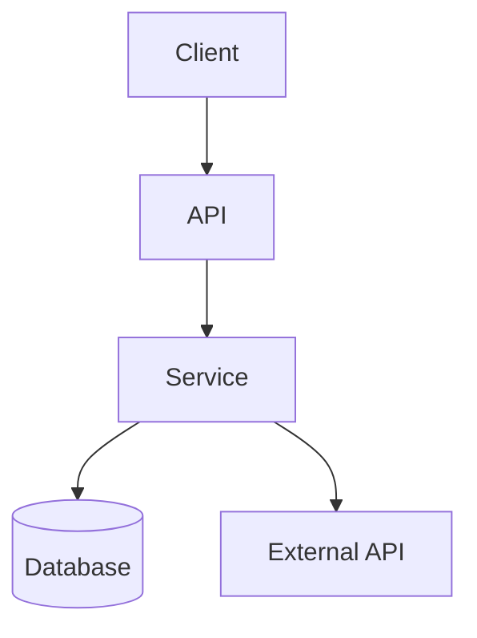
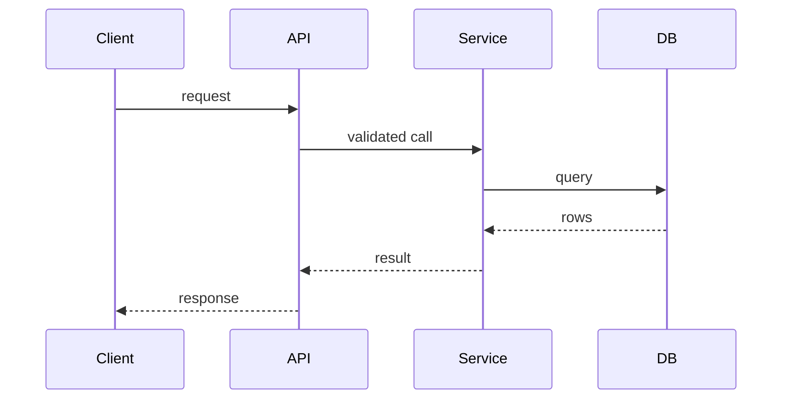

# Project Summary Report Format

When presenting the summary, use this structure. Include only the sections that are in scope and supported by evidence. Keep prose concise and cite file paths for non-trivial claims.

## Header

```
# Project Summary: {project_name}

{one- to two-sentence description of what the project does}

- **Type:** {web app | API service | library | CLI | microservices | serverless | ...}
- **Primary language(s):** {languages}
- **Repository:** {path or name}
```

## Purpose & Overview

```
## Purpose & Overview
{2–4 sentences: what it does, who it is for, the problem it solves. Cite README or metadata.}
```

## Tech Stack

```
## Tech Stack
| Layer | Technology | Version | Evidence |
|-------|-----------|---------|----------|
| Language | {e.g., Python} | {3.11} | `pyproject.toml` |
| Framework | {e.g., FastAPI} | {>=0.109} | `requirements.txt` |
| Database | {e.g., PostgreSQL} | {—} | `docker-compose.yml` |
| Runtime/Infra | {e.g., Docker} | {—} | `Dockerfile` |
```

## Architecture

```
## Architecture
{Describe the high-level shape and main boundaries. Cite directory evidence.}
```

Include a diagram when the structure warrants one:

````

````

## Component Responsibilities

```
## Component Responsibilities
| Component | Responsibility | Key Collaborators | Path |
|-----------|----------------|-------------------|------|
| {module/service} | {one sentence} | {what it calls/serves} | `{path}` |
```

## Data Flow

```
## Data Flow
{Narrate one representative operation from entry point to response/side effect.}
```

Include a sequence or flow diagram when it clarifies the path:

````

````

## External Integrations & Dependencies

```
## External Integrations & Dependencies
| Integration | Type | Evidence | Config (name only) |
|-------------|------|----------|--------------------|
| {e.g., PostgreSQL} | database | `db/session.py` | `DATABASE_URL` |
| {e.g., Auth0} | auth provider | `auth/jwt.py` | `AUTH0_DOMAIN` |
```

Report environment variables by name only. Never include secret values.

## CI/CD & Deployment

```
## CI/CD & Deployment
- **Triggers:** {push/PR/tag/schedule} — `{workflow file}`
- **Stages:** {build → test → lint → deploy}
- **Environments:** {dev/staging/prod, if evidenced}
- **Deployment target:** {platform/registry/host} — `{manifest}`
```

If no CI/CD configuration exists, state that explicitly.

## Entry Points & Local Development

```
## Entry Points & Local Development
- **Entry point(s):** `{path}` — {what it starts}
- **Install:** `{command}`
- **Run:** `{command}`
- **Test:** `{command}`
```

Present commands as documented, not verified, unless the session ran them safely.

## Notes & Gaps

```
## Notes & Gaps
- {anything inferred rather than proven}
- {areas where evidence was missing or ambiguous}
```

Mark inferred or unknown items honestly instead of presenting guesses as fact.
